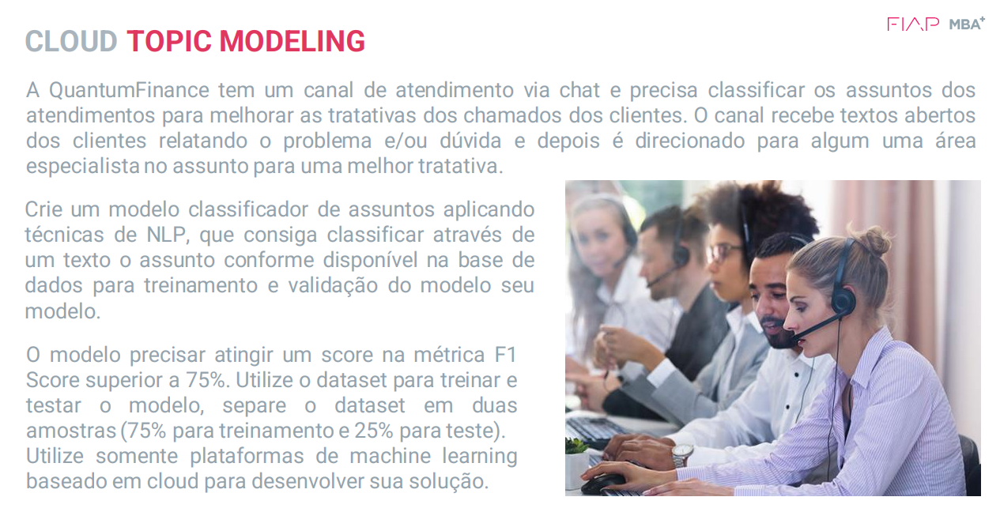

# MBA FIAP Inteligência Artificial & Machine Learning
### Projeto de Conclusão: Topic Modeling


### Topic Modeling

Topic Modeling em Fintechs: Uma Ferramenta Contra Fraudes
Uma fintech inovadora, especializada em soluções financeiras para pessoas físicas, identificou um aumento significativo em incidentes de fraudes relacionadas a transações bancárias e serviços contratados indevidamente. Diversos clientes relataram não ter solicitado certos serviços, como empréstimos ou seguros, que misteriosamente foram ativados em suas contas, seguidos por transferências para destinos desconhecidos.

A investigação conduzida pelo departamento de segurança confirmou que as transações foram autenticadas corretamente com as senhas dos clientes, indicando que os protocolos de segurança padrão foram seguidos, mas não foram suficientes para prevenir essas atividades fraudulentas. Diante da gravidade da situação, a empresa se viu obrigada a reembolsar os clientes afetados e buscar soluções eficazes para mitigar futuros riscos e preservar sua reputação.

Uma abordagem promissora para enfrentar este desafio é a aplicação de técnicas de Modelagem de Tópicos (Topic Modeling) nos dados de transações e interações dos clientes. Essa metodologia de aprendizado de máquina não supervisionado permite analisar grandes volumes de textos (ou transações, neste caso) para identificar padrões ocultos, temas recorrentes ou comportamentos anômalos que poderiam indicar a presença de fraudes.

Implementando algoritmos de Topic Modeling, como Latent Dirichlet Allocation (LDA) ou Non-negative Matrix Factorization (NMF), a fintech pode automaticamente categorizar transações em grupos temáticos baseados em sua semelhança. Isso possibilita a detecção precoce de atividades suspeitas ou não característicos do perfil do cliente, como a contratação de serviços não usuais ou transferências atípicas, que poderiam ser indicativos de fraude.

Além de identificar potenciais fraudes, a Modelagem de Tópicos oferece insights valiosos sobre tendências de comportamento do cliente, permitindo aprimorar a personalização de serviços e reforçar medidas de segurança. Por exemplo, a análise de tópicos pode revelar a necessidade de autenticações adicionais para certas categorias de transações ou ajustes nos limites de transferência.

Para garantir a eficácia dessa solução, é crucial a constante recalibragem dos modelos de Topic Modeling com novos dados, acompanhada de uma revisão periódica dos temas identificados. Isso assegura a adaptação às evoluções nas táticas de fraude e às mudanças no comportamento dos clientes.

Em suma, a Modelagem de Tópicos se apresenta como uma ferramenta poderosa e versátil para fintechs na luta contra fraudes, oferecendo uma camada adicional de inteligência analítica para identificar e prevenir atividades fraudulentas, ao mesmo tempo em que contribui para a melhoria contínua da experiência do cliente.



## 1. Instruções

No projeto utilizamos Jupyter Notebook, podendo ser construindo utilizando a distribuição Anaconda

Para instalar, acesse a sessão de [Downloads](https://www.anaconda.com/download) do Anaconda.


### 2. Repositório

Este repositório contém os arquivos utilizados.

>**Importante**: Decidimos seguir utilizando o projeto de Topic Modeling:

```
Crie  um  modelo  classificador  de  assuntos  aplicando 
técnicas  de  NLP,  que  consiga  classificar  através  de 
um  texto  o  assunto  conforme  disponível  na  base  de 
dados  para  treinamento  e  validação  do  modelo  seu 
modelo.

O  modelo  precisar  atingir  um  score  na  métrica  F1 
Score superior a 75%. Utilize o dataset para treinar e 
testar o modelo, separe o dataset em duas 
amostras (75% para treinamento e 25% para teste).
Utilize  somente  plataformas  de  machine  learning 
baseado em cloud para desenvolver sua solução.
````

### 3. Template guiado

[](https://colab.research.google.com/github/ersjunior/3DTS-CognitiveEnvironments/blob/main/Projeto_Final/topic_modeling_notebook.ipynb)

> **Atenção: Template desenvolvido para o projeto de Topic Modeling.**

### 4. Bibliotecas utilizadas

Este projeto requer **Python 3.5 ou superior** e as seguintes bibliotecas:

- [pandas](https://pandas.pydata.org/)
- [seaborn](https://seaborn.pydata.org/)
- [matplotlib](https://matplotlib.org/)
- [sklearn](https://scikit-learn.org/stable/)
- [nltk](https://www.nltk.org/)

## 🚀 Tecnologias
<div>
  
  
  
  
  
  
</div>
